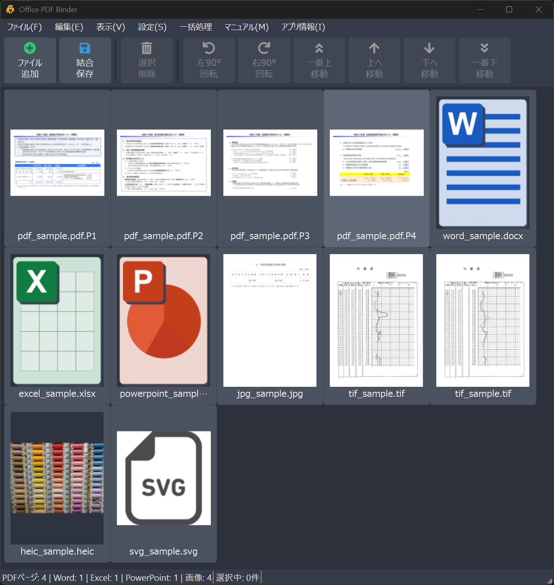
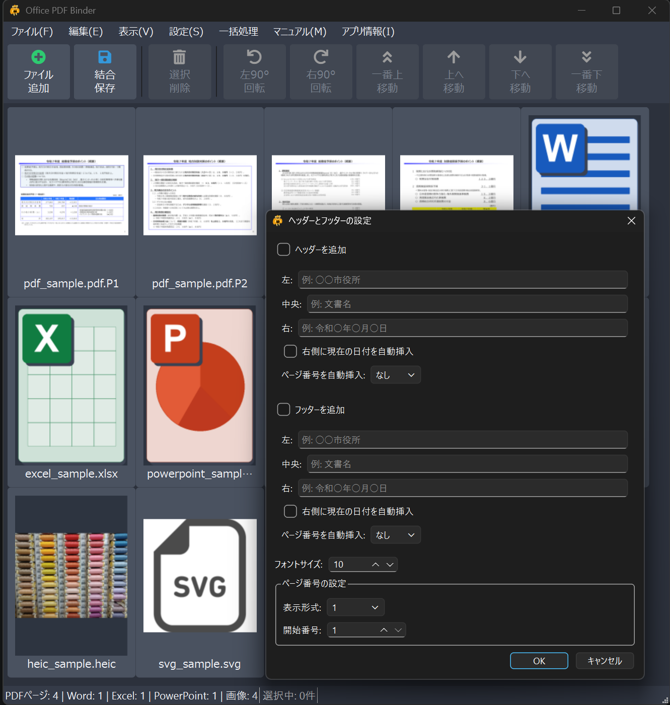

# Office PDF Binder

[English](README.md) | 日本語

Office PDF Binder は、PDFをページ単位で並べ替え・削除・回転し、Word / Excel / PowerPoint 文書と一緒に1つのPDFへ結合できる Windows デスクトップアプリです。

PDF、Word、Excel、PowerPoint の資料をまとめて、提出用・共有用の PDF を作る作業を効率化するために作成しました。

PDFはページ単位で読み込みます。Word / Excel / PowerPoint はファイル単位で追加し、保存時にMicrosoft OfficeでPDFへ変換して結合します。



---

## 1. 対応環境

- Windows 10 / 11（64bit）
- Microsoft Office（Word / Excel / PowerPoint ファイルを変換する場合）
- インストーラー版の利用に、追加の Python やライブラリは不要

---

## 2. 主な機能

- PDFをページ単位で読み込み、並べ替え・削除・回転して結合
- Word / Excel / PowerPointをファイル単位で追加し、保存時にPDFへ変換して結合
- 対応ファイルをアプリ画面へドラッグ&ドロップして開く機能
- ページごとの移動・削除・回転（90 度単位）
- ドラッグ&ドロップによるページ並び替え（複数選択対応）
- ファイルの重複チェック
- 既存PDFしおりの読み込み
- 自動しおり（ファイル先頭ページ）と手動しおり編集
- 保存PDFを開いたときのしおりパネル自動表示
- ヘッダーとフッターの追加（テキスト、日付、ページ番号）
- 選択ページをPDFとしてエクスポート
- 選択ページを画像としてエクスポート（JPEG形式・300dpi・PDFページのみ対象）
- ダブルクリックで元のファイルを標準ビューアで開く
- ズーム 5 段階（Ctrl+ホイール対応）とサムネイル高速化
- Undo / Redo（15 ステップ）
- エクスプローラーの右クリックメニューからファイル追加

対応拡張子:

`.pdf / .docx / .doc / .docm / .xlsx / .xls / .xlsm / .pptx / .ppt / .pptm`

---

## 3. ダウンロード

GitHub Releases から最新版のインストーラーまたはポータブルZIPをダウンロードしてください。

```text
OfficePDFBinder_Setup_1.2.0.exe
OfficePDFBinder_Portable_1.2.0.zip
```

インストーラーで導入すると、アプリ本体、ライセンス文書、ユーザーマニュアル、ソースコード一式がインストール先に配置されます。

### インストール時の注意

- v1.0.0 をインストール済みの場合は、先に v1.0.0 をアンインストールしてから v1.2.0 をインストールしてください。
- 本アプリは個人開発の未署名アプリです。環境によっては Windows SmartScreen などの警告が表示される場合があります。
- Word / Excel / PowerPoint ファイルをPDF変換するには、Microsoft Office がインストールされている必要があります。

---

## 4. 基本操作

### 4.1 ファイル追加

- ツールバーの「ファイル追加」ボタン、`Ctrl+O`、またはアプリ画面へのドラッグ&ドロップで追加できます。
- 対応ファイルをアプリ画面に直接ドロップすると、そのファイルを開いてページ一覧に追加できます。
- エクスプローラーで複数ファイルを選択して右クリックし、「Office PDF Binder で開く」から追加できます。
- 既に追加済みのファイルは自動でスキップされます。

### 4.2 ページ編集

- ページを選択すると、ツールバーや右クリックメニューの操作が有効になります。
- 左右 90 度回転、上下移動、一番上 / 一番下への移動、削除ができます。
- `Delete` キーで削除、`Ctrl+A` ですべて選択できます。
- 複数ページを選択してドラッグ&ドロップで並び替えできます。
- 選択したページを長押し（約0.5秒）すると、ページ移動モードに切り替わります。

### 4.3 新規作成

- `ファイル → 新規` で、現在のリストをクリアして初期状態に戻せます。

### 4.4 しおり

- `表示 → しおり` で、しおりパネルの表示/非表示を切り替えます。
- PDFに既存のしおりがある場合は、読み込み時に取り込まれます。
- `設定 → ファイルごとにしおりを自動作成` で、ファイル先頭ページの自動しおりを切り替えられます。
- 選択ページを右クリックして「選択ページにしおりを追加」を選ぶと、手動しおりを追加できます。
- しおりパネルから、しおりの追加、名前変更、削除ができます。
- しおりをダブルクリックすると、該当ページへ移動します。
- 自動しおりの名前を変更すると、手動しおりとして扱われます。
- `設定 → 保存したPDFを開くときにしおりを表示` で、保存PDFを開いたときにPDFビューアのしおりパネルを表示するかを切り替えられます。

### 4.5 ズーム

- `表示 → 拡大` / `縮小` / `ウィンドウに合わせる` で表示倍率を変更できます。
- `Ctrl` + ホイールでもズームできます。
- `Ctrl+0` で標準表示に戻せます。
- 5 段階（約 0.33〜3.06 倍）を切り替え、サムネイルはキャッシュから高速に更新されます。

### 4.6 ヘッダーとフッター

- `設定 → ヘッダーとフッター` で、保存時に追加するヘッダーとフッターを設定できます。
- ヘッダー / フッターそれぞれに、左・中央・右のテキストを指定できます。
- 右側に現在の日付を自動挿入できます。
- ページ番号の位置、形式、開始番号、フォントサイズを設定できます。
- 設定内容は保存時に全ページへ適用されます。



### 4.7 エクスポート

- `ファイル → 選択ページをPDFとして書き出し` で、選択したページを書き出せます。
- PDFページは選択ページのみを書き出します。
- Word / Excel / PowerPoint は、そのファイルを1つ選んだ場合に、そのファイル全体を書き出します。
- `ファイル → 選択ページを画像として書き出し` で、選択したPDFページを JPEG（300dpi）として書き出せます。
- 画像書き出しはPDFページのみ対象です。

### 4.8 ファイルを開く

- ページをダブルクリックすると、元のファイルを標準ビューアで開きます。

### 4.9 PDF保存

- `ファイル → 名前を付けて保存` または `Ctrl+S` で結合PDFを保存します。
- 保存完了後、結合したPDFファイルが標準ビューアで自動的に開きます。
- その後、リストをクリアするかどうか確認ダイアログが表示されます。

---

## 5. 右クリックメニュー

ページを右クリックすると、選択状態に応じて以下の操作ができます。

- ファイル追加
- 左右 90 度回転
- 一番上 / 上 / 下 / 一番下へ移動
- 選択ページにしおりを追加
- 選択ページをPDFとして書き出し
- 選択ページを画像として書き出し
- 削除

---

## 6. キーボードショートカット

| 操作 | ショートカット |
|------|----------------|
| 新規 | `Ctrl+N` |
| ファイル追加 | `Ctrl+O` |
| 保存 | `Ctrl+S` |
| 終了 | `Ctrl+Q` |
| 全選択 | `Ctrl+A` |
| 削除 | `Delete` |
| ズームイン / アウト | `Ctrl` + `+` / `-` または `Ctrl` + ホイール |
| ウィンドウに合わせる | `Ctrl+0` |
| ヘッダーとフッター | `Ctrl+H` |
| 元に戻す / やり直し | `Ctrl+Z` / `Ctrl+Y` |

---

## 7. トラブルシューティング

### Office ファイルが追加できない

- Microsoft Office がインストール済みか確認してください。
- 対象ファイルが他のアプリで開かれていないか確認してください。
- パスワード保護や破損したファイルは変換できない場合があります。

### PDF 保存に失敗する

- 保存先に書き込み権限があるか確認してください。
- 空き容量が 100MB 以上あるか確認してください。
- 保存先ファイルを他アプリで開いていないか確認してください。

### 画像として書き出せない

- 画像書き出しはPDFページのみ対象です。
- Word / Excel / PowerPoint などのOfficeページは画像書き出し対象外です。

### メモリ不足 / 画面が固まる

- 大量ページを扱う場合はファイルを分割して処理してください。
- ズーム倍率を下げるとサムネイル再生成が軽くなります。

---

## 8. 開発・ビルド

開発時は、OfficePDFBinder 用の Python 環境を有効化して作業します。

確認済みの開発環境:

- Python 3.12.12

主な依存関係:

- PyMuPDF
- PySide6
- Pillow
- qtawesome
- pywin32
- Nuitka
- Markdown
- Inno Setup 6

Python パッケージは以下でインストールできます。

```powershell
python -m pip install -r requirements.txt
```

テスト用パッケージを追加し、pytest を実行するには次を使用します。

```powershell
python -m pip install -r requirements-dev.txt
python -m pytest
```

自動テストの内訳と、Office・インストーラーを含む手動確認項目は
[`TESTING.md`](TESTING.md) を参照してください。

ビルド操作は `build.ps1` に統一しています。本体を変更せず、既存の `dist` から説明書とインストーラーだけを再生成する場合は、次を実行します。

```powershell
.\build.ps1 -Mode Package
```

本体変更後の開発確認では、Nuitka中間生成物を再利用する高速ビルドを実行します。

```powershell
.\build.ps1 -Mode Fast
```

公開用の最終確認では、クリーンビルドを実行します。

```powershell
.\build.ps1 -Mode Release
```

`Fast`と`Release`は、配布用の`dist`、ポータブル版、インストーラーを作成します。`Package`はNuitkaを実行せず、既存の`dist`を使ってインストーラーだけを再生成します。

ビルドが完了すると、インストーラーとポータブル版（フォルダー、ZIP）が `Output/` に出力されます。Nuitkaによるアプリ本体のビルドは1回だけです。

各モードは必要に応じて、アプリ内マニュアル用の `README.html` と、AGPL対応のために同梱する `source.zip` も再生成します。

ポータブル版には、実行ファイルと同じフォルダーに `OfficePDFBinder.portable` が同梱されます。このファイルがある場合、AppDataへの設定保存とホームフォルダーへのデバッグログ出力を行わず、Office変換用の一時PDFは変換元Officeファイルと同じフォルダーに作成して処理後に削除します。マーカーファイルを削除すると通常モードになるため、配布時は削除しないでください。

---

## 9. リポジトリ運用

Gitリポジトリには、ソースコード、ビルドスクリプト、ライセンス文書、READMEを含めます。

以下はGit管理対象外です。

- Nuitka のビルド成果物
- インストーラー
- `source.zip`
- ローカルバックアップ
- 検証用ファイルや一時ファイル

配布用インストーラーは、GitHub Releases の Assets として公開します。

---

## 10. ライセンス

- ライセンス: GNU AGPL v3.0（詳細は `LICENSE.txt`）
- 使用ライブラリ: PyMuPDF, PySide6, Pillow, qtawesome, pywin32 など（詳細は `NOTICE.txt`）

---

Copyright (C) 2026 Takeshi Kashiwagi
