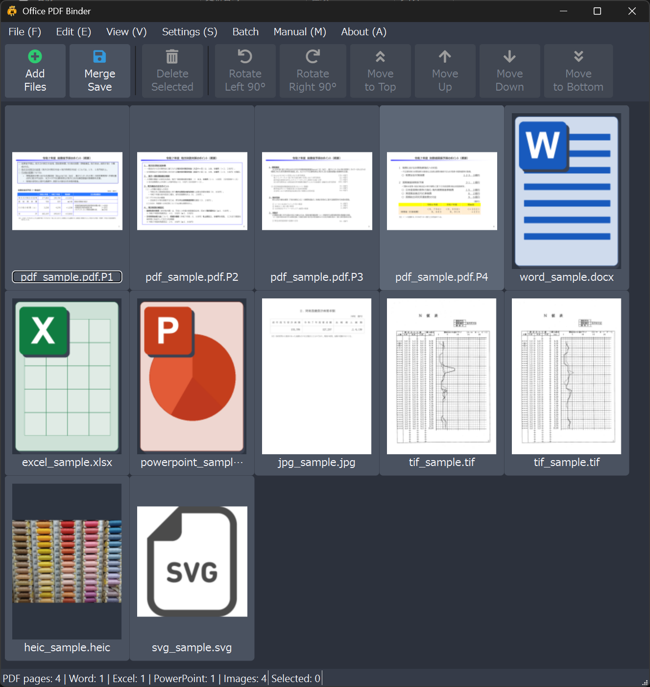
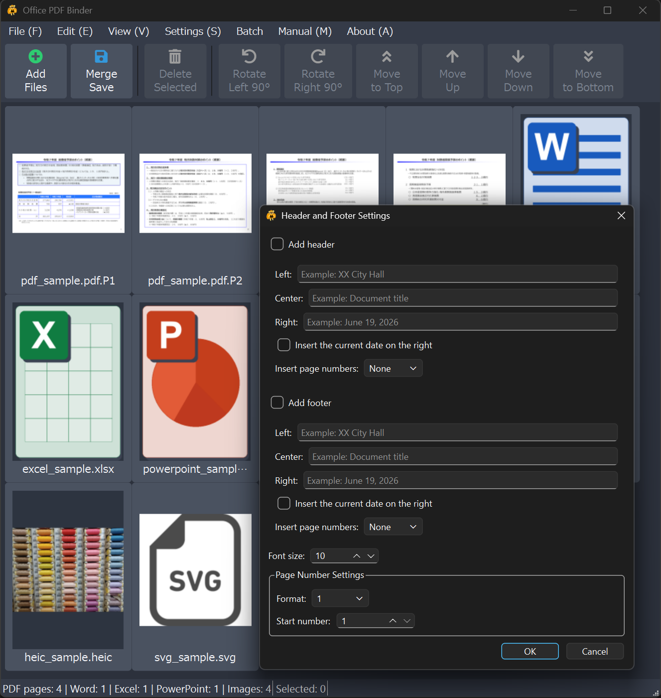

# Office PDF Binder

English | [日本語](README.ja.md)

Office PDF Binder is a Windows desktop application that combines PDF, Word,
Excel, PowerPoint, and image files into a single PDF. You can organize, delete,
and rotate individual PDF pages before saving the result.



---

## 1. Requirements

- Windows 10 or Windows 11 (64-bit)
- Microsoft Office or LibreOffice when converting Word, Excel, or PowerPoint files
- No separate Python installation is required for packaged releases

Office files are converted through locally installed Microsoft Office or
LibreOffice applications. Office PDF Binder does not upload documents to an
online service.
PDF files are loaded as individual pages. Word, Excel, and PowerPoint documents
are added as files and converted to PDF when the combined PDF is saved.

---

## 2. Features

- Load, reorder, delete, and rotate individual PDF pages
- Add Word, Excel, and PowerPoint documents as files and convert them through
  Microsoft Office or LibreOffice when saving
- Add PNG, JPEG, BMP, WebP, TIFF, HEIC, HEIF, and SVG images as A4 PDF pages
- Insert A4 portrait blank pages
- Add files with a file dialog, drag and drop, or Windows Explorer
- Reorder, delete, and rotate PDF pages
- Reorder multiple selected pages by dragging them together
- Detect duplicate files
- Import existing PDF bookmarks
- Create automatic bookmarks for each source file
- Add, rename, delete, and navigate manual bookmarks
- Add headers, footers, dates, and page numbers
- Export selected pages as a PDF
- Export selected PDF pages as JPEG images at 96, 150, 300, or 600 dpi
- Create one PDF per subfolder in batch mode
- Remove comments, drawings, and highlights stored as PDF annotations
- Suppress Word comments and tracked changes, and Excel comments when converting to PDF
- Prevent small images from being enlarged when converting images to PDF pages
- Open the original file by double-clicking a page
- Five thumbnail zoom levels with Ctrl+mouse wheel support
- Undo and redo up to 15 changes

Supported extensions:

`.pdf / .docx / .doc / .docm / .xlsx / .xls / .xlsm / .pptx / .ppt / .pptm / .png / .jpg / .jpeg / .bmp / .webp / .tif / .tiff / .heic / .heif / .hif / .svg`

---

## 3. Installation and Portable Version

Download the latest installer or portable ZIP from GitHub Releases.

The installer includes the application, this manual, license documents, and
the corresponding source archive. The installer can be displayed in English
or Japanese, and Office PDF Binder uses the language selected during setup.

The portable version automatically uses Japanese on a Japanese Windows system
and English on other Windows language settings.

### Installation notes

- Uninstall an older release before installing a version that cannot be
  upgraded in place.
- This is an unsigned independently developed application. Windows SmartScreen
  may display a warning.
- Microsoft Office or LibreOffice is required only for Word, Excel, and
  PowerPoint conversion. Microsoft Office generally provides the best fidelity;
  LibreOffice is useful when Microsoft Office is unavailable.

---

## 4. Basic Use

### 4.1 Add files

- Select **Add Files**, press `Ctrl+O`, or drag supported files into the window.
- You can select multiple supported files in Windows Explorer and use
  **Open with Office PDF Binder**.
- Files already present in the list are detected and are not added twice.

### 4.2 Organize pages

- Select one or more pages to enable page operations.
- Rotate pages 90 degrees left or right.
- Move pages up, down, to the top, or to the bottom.
- Press `Delete` to remove selected items and `Ctrl+A` to select all items.
- Drag selected pages to reorder them while preserving their relative order.

Office documents appear as a single item in the list. They are converted to
PDF when the combined document is saved.

### 4.3 Start a new session

Select **File > New** to clear the current list, bookmarks, and page settings.

### 4.4 Bookmarks

- Select **View > Bookmarks** to show or hide the bookmarks panel.
- Existing PDF bookmarks are imported when a PDF is added.
- Enable **Settings > Create Bookmarks for Each File** to create a bookmark at
  the first page of each source file.
- Right-click a selected page and choose **Add Bookmark to Selected Page**.
- Use the bookmarks panel to add, rename, or delete bookmarks.
- Double-click a bookmark to navigate to its page.
- Renaming an automatic bookmark converts it to a manual bookmark.

### 4.5 Zoom

- Use **View > Zoom In**, **Zoom Out**, or **Fit to Window**.
- Hold `Ctrl` while using the mouse wheel to zoom.
- Press `Ctrl+0` to fit the thumbnails to the window.

### 4.6 Headers, footers, and page numbers

Select **Settings > Header and Footer** to configure content added when the PDF
is saved.

- Enable the header, footer, or both.
- Enter separate text for the left, center, and right positions.
- Insert the current date on the right.
- Select the page-number position and format.
- Set the first page number and font size.



### 4.7 Export selected pages

- Select **File > Export Selected Pages as PDF** to create a PDF containing
  only the selected pages.
- Select **File > Export Selected Pages as Images** to export selected PDF pages
  as JPEG images at 96, 150, 300, or 600 dpi. The default is 300 dpi.
- Word, Excel, and PowerPoint items cannot be exported as images.

Use **Edit > Organize Pages > Insert Blank Page** to insert an A4 portrait blank
page. If a page is selected, the blank page is inserted after the selected page;
otherwise it is added to the end.

Image files are added as single A4 pages. Landscape images use A4 landscape,
and portrait or square images use A4 portrait. The image is centered on the page
while preserving its aspect ratio.

Enable **Settings > Do Not Enlarge Small Images** to keep small images at or
below their 96 dpi reference size. Images larger than the printable area are
still reduced to fit the A4 page.

### 4.8 Output cleanup settings

- Enable **Settings > Remove PDF Comments and Markups** to exclude comments,
  drawings, highlights, and other objects stored as PDF annotations from the
  saved PDF. Text or drawings already flattened into page contents are not
  removed.
- Enable **Settings > Suppress Word Comments and Tracked Changes, and Excel
  Comments in PDFs** to suppress Word comments/tracked changes and Excel
  printed comments during PDF conversion. PowerPoint files are converted
  normally.

### 4.9 Combine and save

Select **File > Save As** or press `Ctrl+S`. Choose an output path, and Office
PDF Binder combines the current list into one PDF.

After saving, the PDF opens in the default PDF viewer. The application then
asks whether to clear the current list.

### 4.10 Create PDFs by subfolder

Select **Batch > Create PDFs by Subfolder** to create one PDF for each
subfolder directly under a selected parent folder.

- Files directly inside each subfolder are combined in filename order.
- Nested subfolders are not searched.
- Unsupported files are skipped and recorded in a CSV log.
- Existing PDFs are skipped by default, unless overwrite is enabled.
- The CSV log is written to the output folder using UTF-8 with BOM for Excel.
- The Office conversion engine can be set to Auto, Prefer Microsoft Office, or
  Prefer LibreOffice.
- Failed Office conversions are retried automatically up to two times with a
  one-second delay.

### 4.11 Command-line batch processing

The same batch operation can be run from PowerShell or a BAT file.

```powershell
$cliArgs = @(
  "--batch-subfolders"
  '--input-root="C:\Work\Input"'
  '--output-root="C:\Work\Output"'
)
$process = Start-Process `
  -FilePath ".\OfficePDFBinder_Main.exe" `
  -ArgumentList $cliArgs `
  -Wait -PassThru -NoNewWindow
$process.ExitCode
```

The PDFs and UTF-8 BOM CSV log are written to the specified output folder. CLI
mode uses its command-line options and fixed defaults instead of saved GUI
settings. `Start-Process -Wait -PassThru` ensures that PowerShell waits for the
GUI-format executable and receives its exit code.

Available options:

```text
--auto-bookmarks / --no-auto-bookmarks
--show-bookmarks-on-open / --no-show-bookmarks-on-open
--remove-pdf-annotations
--suppress-office-markup
--disable-image-upscaling
--overwrite
```

Exit codes are `0` only when every subfolder succeeds, `1` when any result is
Warning, Skipped, or Error, `2` for invalid arguments, `3` when the input
folder is missing, `4` when there are no subfolders, `5` when the log cannot
be written, and `9` for an unexpected error.

---

## 5. Keyboard Shortcuts

| Action | Shortcut |
|---|---|
| New | `Ctrl+N` |
| Add Files | `Ctrl+O` |
| Combine and Save | `Ctrl+S` |
| Exit | `Ctrl+Q` |
| Select All | `Ctrl+A` |
| Delete Selected | `Delete` |
| Zoom In / Out | `Ctrl` + `+` / `-`, or `Ctrl` + mouse wheel |
| Fit to Window | `Ctrl+0` |
| Header and Footer | `Ctrl+H` |
| Undo / Redo | `Ctrl+Z` / `Ctrl+Y` |

---

## 6. Troubleshooting

### An Office file cannot be converted

- Verify that Microsoft Office or LibreOffice is available.
- Check whether **Settings > Office Conversion Engine** matches the environment.
- Close the document in other applications and try again.
- Password-protected or damaged documents may not be convertible.

### A PDF cannot be saved

- Check that you have write permission for the output folder.
- Keep at least 100 MB of free space on the output drive.
- Close the output PDF if it is open in another application.

### Pages cannot be exported as images

Image export supports PDF pages only. Word, Excel, and PowerPoint items are not
included.

### High memory use or slow thumbnails

- Split very large documents into smaller operations when practical.
- Reduce the thumbnail zoom level.

---

## 7. Portable Edition

The portable package contains `OfficePDFBinder.portable`. Keep this
marker file next to the executable.

In the portable edition, Office PDF Binder:

- does not save application settings in AppData;
- does not write its optional debug log to the user profile; and
- creates temporary Office-conversion PDFs beside the source Office file and
  deletes them after processing.

Microsoft Office, Windows, and Qt may still use their own system services,
temporary folders, caches, or registry settings.

---

## 8. Development and Testing

The verified development and test environment uses Python 3.13.11.
Windows builds use the Visual Studio C++ Clang tools (`clang-cl`).

Install runtime and development dependencies with:

```powershell
python -m pip install -r requirements.txt
python -m pip install -r requirements-dev.txt
```

Run automated tests with:

```powershell
python -m pytest
```

Before distributing a build, verify executable startup, Office conversion,
CLI behavior, and installation separately.

Build operations use the single `build.ps1` entry point. To regenerate only
the manual and installer from the existing `dist`, run:

```powershell
.\build.ps1 -Mode Package
```

After application code changes, reuse Nuitka intermediate files with:

```powershell
.\build.ps1 -Mode Fast
```

For the final public release, run a clean build:

```powershell
.\build.ps1 -Mode Release
```

`Fast` and `Release` create the distribution directory, portable package, and
installer. `Package` skips Nuitka and regenerates only the installer from the
existing distribution directory.

The Nuitka application is compiled once. The same distribution directory is
used for the installer and the marker-based portable ZIP.

Supporting build scripts are stored in `scripts/`, and the Inno Setup definition
is stored in `packaging/`. Run `build.ps1` from the project root.

---

## 9. License

- Office PDF Binder: GNU Affero General Public License v3.0 (`LICENSE.txt`)
- Third-party components: see `NOTICE.txt`
- Corresponding source: included as `source.zip` in both installer and portable packages

---

Copyright (C) 2026 Takeshi Kashiwagi
